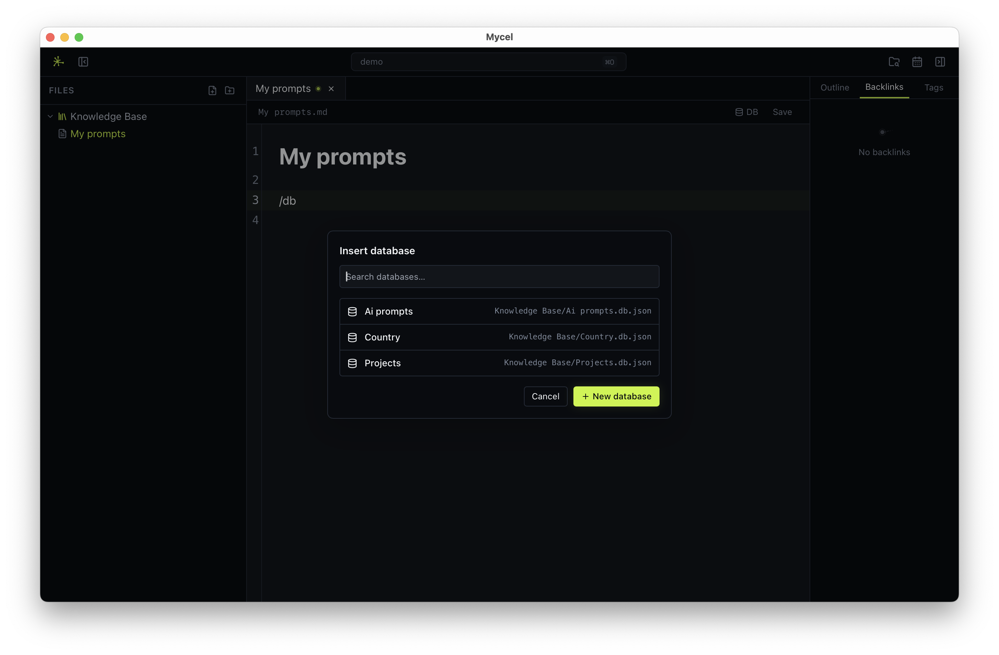
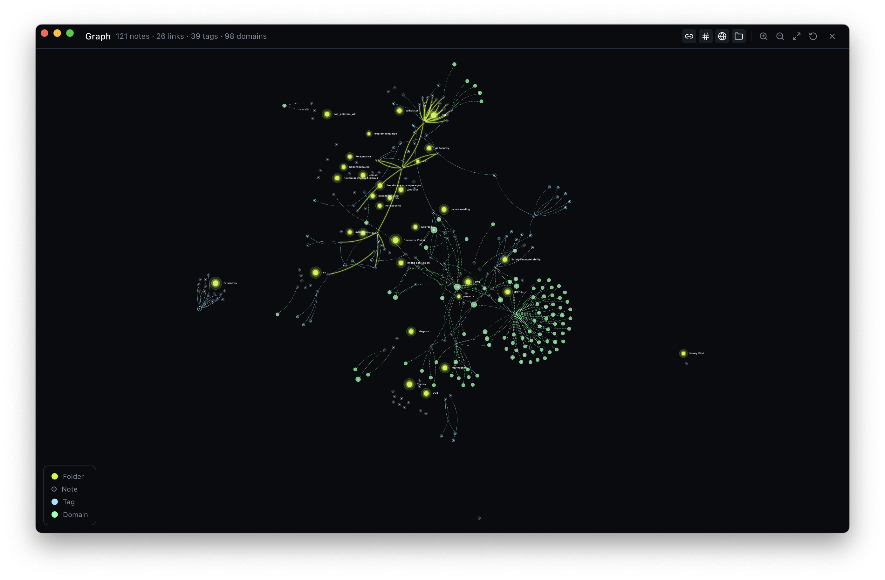

<p align="center">
  
</p>

<h1 align="center">Mycel</h1>

<p align="center">
  <strong>The local-first Markdown knowledge base that feels like a desktop app — because it is one.</strong>
</p>

<p align="center">
  Plain <code>.md</code> files on disk. A real Rust + Tauri shell. Wikilinks, a force-directed graph, inline databases, GitHub-backed sync, and a global hotkey that turns a fleeting thought into a note in under a second.
</p>

<p align="center">
  <a href="#-quick-start"></a>
  &nbsp;
  <a href="https://github.com/Mycel-AI-notes/Mycel/stargazers"></a>
  &nbsp;
  <a href="LICENSE"></a>
</p>

<p align="center">
  <a href="https://tauri.app"></a>
  <a href="https://www.rust-lang.org/"></a>
  <a href="https://react.dev"></a>
  <a href="https://www.typescriptlang.org/"></a>
  <a href="https://tailwindcss.com/"></a>
  <a href="#"></a>
  <a href="#"></a>
  <a href="#"></a>
</p>

<p align="center">
  
</p>

<p align="center"><sub>Above: editor + inline <code>mycel-db</code> block. Below: the vault graph.</sub></p>

<p align="center">
  
</p>

---

## ✨ Why Mycel?

Most "second brains" lock your notes in a proprietary format, a slow Electron container, or somebody else's cloud. Mycel makes the opposite bet:

- 📂 **Your files, your folder.** Mycel writes plain Markdown to a directory you pick. iCloud, Syncthing, Git, `grep` — they all keep working. Uninstall Mycel tomorrow and your notes are still there.
- ⚡ **Native, not a browser tab.** Rust backend + a real OS window via Tauri 2. Cold start under a second, no Chromium tax.
- 🧠 **Built for thinking.** Wikilinks, backlinks, a live outline, tag navigation, an inline relational database, a graph that actually shows structure — the tools knowledge workers reach for, without the bloat.
- 🔐 **Optional encrypted sync.** When you want sync, point Mycel at a private GitHub repo. Your token lives in your OS keyring, never in a config file.

> **Status:** active development (v0.1). The features listed under "What's in the box" are all working today. Items in [the roadmap](#-roadmap) are the next things on the bench.

---

## 🚀 Quick start

```bash
git clone https://github.com/Mycel-AI-notes/Mycel.git
cd Mycel
npm install
npm run tauri dev
```

First launch shows the vault picker — point it at **any folder**. Mycel remembers it and auto-opens it next time.

**Prereqs:** [Rust](https://rustup.rs) (stable), [Node.js](https://nodejs.org) 18+, and Tauri's [system dependencies](https://tauri.app/start/prerequisites/) for your OS (Xcode CLT on macOS, `build-essential` + `webkit2gtk` on Linux, MSVC + WebView2 on Windows).

**Build a release binary:**

```bash
npm run tauri build
# bundles under src-tauri/target/release/bundle/ (.app, .dmg, .deb, .AppImage, .msi)
```

---

## 📦 What's in the box

### Writing & navigation

- ✍️  **CodeMirror 6 editor** with Markdown syntax, inline preview decorations, fenced code blocks with per-language highlighting, and autocomplete.
- 🔗 **Wikilinks** — `[[Like this]]` autocomplete, click-to-navigate, missing targets are created for you.
- ⚡ **Slash menu** — type `/` for quick inserts (tables, code, headings, callouts…).
- 📊 **Editable GFM tables** rendered as styled blocks; inline Markdown (links, wikilinks, bold) renders *inside* cells and stays clickable.
- 🗂️ **Tabs done right** — single click opens a *preview* tab (italic). Switching files replaces it, so you don't drown in junk tabs. Save (`⌘/Ctrl+S`) or double-click to pin.
- 🔍 **Quick switcher** (`⌘/Ctrl+O`) — fuzzy search across note titles and paths.
- ⚡ **Quick notes** (`⌘/Ctrl+Shift+N`, **global** — works even when the app is minimised) — drops a timestamped note in `quick/YYYY-MM-DD/` so a thought never gets away.

### Sense-making

- 🕸️ **Spore graph view** (`⌘/Ctrl+G`) — full-screen force-directed graph. Folders cluster as spores, wikilinks become edges, tag and structural connections toggle on or off from the toolbar.
- 📍 **Live outline panel** — every heading in the current note, click to jump.
- ↩️ **Backlinks panel** — folder-aware incoming references, plus outgoing wikilinks and external URLs.
- 🏷️ **Tag system** — `#tags` autocomplete in the editor, dedicated tag panel, tag search across the vault, tag nodes in the graph.

### Structured data

- 🧱 **Inline databases.** Notion-style fenced `mycel-db` blocks render typed tables (text, number, date, select, multi-select, checkbox, page link…) right in the note.
- 🗃️ **Vault picker with recents.** Switch between vaults; Mycel remembers your last one and the last few you used.

### Sync & sharing

- ☁️ **GitHub vault sync** — push and pull your vault to a private GitHub repo. Fine-grained PAT, stored in the **OS keyring** (macOS Keychain / Windows Credential Manager / Secret Service), with auto-sync, manual sync, and clean conflict reporting.
- 📥 **Clone a remote vault** straight from the vault picker — point Mycel at a repo and it bootstraps the local folder.

### Security

- 🔐 **Per-note encryption** — convert any note to `*.md.age` with one click. Uses [age](https://age-encryption.org) (X25519 + ChaCha20-Poly1305), the modern crypto format by [Filippo Valsorda](https://filippo.io) and [Ben Cartwright-Cox](https://github.com/Benjojo12); we depend on the Rust implementation [`str4d/rage`](https://github.com/str4d/rage). Encrypted notes still sync through GitHub as opaque ASCII-armored blobs.
- 🗝️ **Hardware-backed identity** — your X25519 secret is wrapped twice: with a passphrase **you** choose (inner) and a random 256-bit KEK in your OS keyring (outer, Secure Enclave on macOS / TPM-backed DPAPI on Windows). Both factors required to unlock. Plaintext key never touches disk, wiped on lock or after **5 min idle**.
- 👥 **Multi-device** — each device has its own identity. Add another machine's pubkey to `recipients.txt` and notes are readable on both. Existing notes can be re-encrypted to the new recipient set with one button.

### Look & feel

- 🎨 **Color palettes** — Moss, Amber, Azure, Plum, Coral, Classic. Light/dark/system. Picker in the status bar.
- 🍎 **Native window chrome.** macOS traffic lights blend into the title bar; the toolbar is fully drag-region aware.
- ↔️ **Resizable sidebar** — drag the edge, double-click to reset.

---

## ⌨️ Keyboard shortcuts

| Shortcut | Action |
|---|---|
| `⌘/Ctrl + O` | Quick switcher (fuzzy file finder) |
| `⌘/Ctrl + Shift + N` | **Quick note** (works globally, even when Mycel is unfocused) |
| `⌘/Ctrl + G` | Toggle graph view |
| `⌘/Ctrl + S` | Save current note (also pins a preview tab) |
| `/` in the editor | Slash command menu |
| `[[` in the editor | Wikilink autocomplete |
| Double-click a tab | Pin a preview tab |
| Double-click sidebar resize handle | Reset sidebar width |

---

## 🧰 Stack

| Layer | Tech |
|---|---|
| Shell | [Tauri 2](https://tauri.app) |
| Backend | Rust (parser, file watcher, keyring, Git sync) |
| Frontend | React 19 + TypeScript + Vite |
| Editor | CodeMirror 6 |
| Graph | `d3-force` |
| State | Zustand (with `persist` for UI prefs, recent vaults, sync config) |
| Styling | Tailwind CSS |
| Icons | `lucide-react` |
| Markdown | `pulldown-cmark`, `gray_matter` (frontmatter) |
| Secrets | `keyring` (OS-native credential storage) |

---

## 📖 How to use it

1. **Pick a vault.** Any folder works. Mycel doesn't move or rename your files; everything stays as plain `.md`.
2. **Create notes.** Use the `+` icons in the sidebar header (root) or hover a folder row to create inside it.
3. **Link notes.** Type `[[` to autocomplete. Click a rendered wikilink to follow it. If the target doesn't exist, Mycel creates it.
4. **Find notes.** `⌘/Ctrl + O` for the fuzzy switcher.
5. **Capture a fleeting thought.** `⌘/Ctrl + Shift + N` — anywhere on the system — and start typing.
6. **Zoom out.** `⌘/Ctrl + G` opens the spore graph.
7. **Sync (optional).** Open the sync panel, paste a GitHub PAT, point at a private repo. Auto-sync keeps it tidy in the background.
8. **Switch vaults.** The folder icon in the status bar takes you back to the picker.

### Vault layout

```
my-vault/
├── .mycel/              # Mycel's working files (add to .gitignore)
├── quick/
│   └── 2026-05-11/
│       └── 14-32-08.md  # quick notes are filed by date and time
├── projects/
│   └── garden.md
└── inbox.md
```

The `.mycel/` folder holds app metadata. Add it to `.gitignore` if you sync the vault with Git separately.

### Note format

Plain Markdown, optional YAML frontmatter, plus optional fenced databases:

````markdown
---
title: My note
tags: [ideas, ml]
---

# My note

Supports [[WikiLinks]], #tags, **bold**, `code`, GFM tables, and fenced databases.

```mycel-db
view: table
source: inline
columns:
  - { id: name, name: Name, type: text }
  - { id: done, name: Done, type: checkbox }
rows:
  - { name: Sketch idea, done: true }
  - { name: Wire backend, done: false }
```
````

### Encrypted notes (`*.md.age`)

Click the shield icon in the toolbar to set up encryption. You'll be asked
for a passphrase (≥ 8 chars, optional but strongly recommended). Mycel
generates a fresh X25519 keypair for **this device** and wraps the secret
half **twice**: with your passphrase (inner, scrypt) *and* with a random
256-bit key-encryption-key (KEK) in your OS keyring (outer, scrypt). Both
factors are required to unlock — the keyring alone is not enough, so a
per-Lock passphrase prompt actually means something.

The vault auto-locks after 5 minutes of idle. Layout under `.mycel/crypto/`:

```
.mycel/crypto/
├── recipients.txt        # COMMITTED. All public keys allowed to decrypt
│                         # notes in this vault. One device = one pubkey.
├── .gitignore            # COMMITTED. Excludes the per-device files below.
├── local-identity.age    # GITIGNORED. This device's X25519 secret,
│                         # double-wrapped (scrypt(KEK, scrypt(passphrase, …))).
└── local-pubkey.txt      # GITIGNORED. This device's public key.
```

To encrypt an existing note, hover its row in the sidebar and click the
lock icon — the file becomes `<name>.md.age`. Encrypted notes still
appear in the file tree (with a lock badge), get a banner above the
editor showing what's on disk, and sync through GitHub as opaque
ASCII-armored blobs.

**Encryption is not retroactive.** Clicking the lock icon on an existing
`.md` only protects writes *from that moment on*. Anything you saved or
pushed beforehand is still plaintext in git history, in iCloud / Time
Machine / Windows backups, in the GitHub remote. Mycel warns you on the
encrypt action; the only guarantee is to click the lock **before** typing
anything sensitive.

#### Adding a second device

1. **Device 1** runs Set up. `recipients.txt` is created with pubkey-1.
2. Sync to GitHub. Device 2 clones.
3. **Device 2** opens the vault — the shield icon shows "This device has
   not joined the vault". Click → choose a passphrase (your own,
   independent of device 1's) → generates pubkey-2, appends to
   `recipients.txt`.
4. Sync. Now both pubkeys are in `recipients.txt`; any note encrypted
   **going forward** is readable on both.
5. For notes encrypted **before** device 2 joined: on device 1, open the
   shield panel → *Re-encrypt all notes* → re-wraps every `.md.age` to
   the current recipient set. Push. Device 2 pulls and reads them.

Credits: the on-disk format is plain age, so encrypted notes round-trip
through the upstream `age` CLI and any other age-compatible tool. Thanks
to [Filippo Valsorda](https://filippo.io) and
[Ben Cartwright-Cox](https://github.com/Benjojo12) for the spec, and to
[@str4d](https://github.com/str4d) for the Rust implementation we depend
on.

---

## 🗺️ Roadmap

The big things on the bench, roughly in priority order:

- 🔎 **Semantic search** — embed your notes locally and search by meaning, not just keywords. "What did I write about Bayesian priors in March?" — works even if the note never used those exact words.
- 🤖 **Local AI integrations** — pluggable local LLM backends (Ollama, llama.cpp, LM Studio). A proactive assistant that surfaces related notes, suggests links, drafts daily summaries, and answers questions grounded in your vault. Everything runs on your machine by default; bring-your-own cloud key is opt-in.
- 🔐 **Encrypted notes** *(security-grade)* — per-note encryption to `.md.age` files using [age](https://github.com/FiloSottile/age) with X25519 keys, mastered by a hardware-backed identity (Secure Enclave on macOS, TPM on Windows/Linux, FIDO2/YubiKey as a portable option). The plaintext private key **never** touches disk; decryption happens in-process and is wiped on lock. Optional post-quantum (Kyber) wrapping for long-lived secrets. Encrypted notes still sync as opaque blobs through GitHub.
- 🧮 **LaTeX support** — inline `$…$` and block `$$…$$` math, rendered with KaTeX. Copy-as-image for sharing, optional MathML output for accessibility.
- 🌳 **Knowledge-base hierarchy** — first-class nested structure: collapsible KB sections, breadcrumb navigation, parent/child relations surfaced in the graph and backlinks, drag-to-reparent in the sidebar.
- 🖼️ **Image support** — drag-and-drop / paste images, stored next to the note (or in a configurable `attachments/` folder) and rendered inline.
- 🎨 **Community themes** — a theme picker open to contributions.
- 📱 **Mobile companion** — read-only first, capture second.

📋 **The full roadmap lives in [GitHub Issues](https://github.com/Mycel-AI-notes/Mycel/issues)** — that's where the granular tickets, design discussions, and "good first issue" tags live. **Everyone is invited to contribute** — pick a ticket, drop a comment, send a PR. New ideas welcome too.

---

## 🤝 Contributing

**Mycel is open to contributors and we'd love your help.** PRs, issues, design feedback, themes, screenshots, blog posts — all welcome.

Good first issues:

- Hunt for a bug in the [issues](https://github.com/Mycel-AI-notes/Mycel/issues) tab — we tag beginner-friendly ones.
- Add a color palette (a few entries in `src/stores/ui.ts` and matching CSS variables).
- Add a slash-menu entry (see `src/components/editor/SlashCompletion.ts`).
- Improve the empty-state hero (`src/components/editor/EmptyEditor.tsx`).

**Workflow:**

```bash
# fork on GitHub, then:
git clone https://github.com/<you>/Mycel.git
cd Mycel && npm install
npm run tauri dev      # iterate
npm run lint           # before pushing
```

Open a PR against `main` with a short summary of *why* the change matters. Commits roughly follow Conventional Commits (`feat(editor): …`, `fix(graph): …`).

### 📝 Contributor License Agreement

Before your first PR is merged, please sign the [**Mycel CLA**](./CLA.md) — it's short, modelled on the Apache ICLA 2.0, and exists so the project stays legally clean as it grows (including future commercial editions that fund development). You keep full copyright in your contribution. The [CLA Assistant bot](https://cla-assistant.io/) will prompt you automatically on your first PR; a one-line manual statement also works.

### Frontend-only dev (no Tauri shell)

If you just want to hack on the UI:

```bash
npm run dev   # Vite on http://localhost:1420
```

File-system commands won't be available (the vault picker needs the Tauri runtime), but components render fine.

---

## 🏗️ Project structure

```
.
├── src/                       # React frontend
│   ├── components/
│   │   ├── editor/            # CodeMirror editor, tabs, slash menu, wikilinks
│   │   ├── sidebar/           # File tree
│   │   ├── ui/                # Right panel, palette picker, primitives
│   │   ├── graph/             # Force-directed graph view
│   │   ├── search/            # Quick switcher, tag search
│   │   ├── sync/              # GitHub sync panel, clone dialog
│   │   ├── database/          # Inline mycel-db blocks
│   │   ├── table/             # GFM table editor
│   │   ├── markdown/          # Inline Markdown rendering
│   │   ├── onboarding/        # Vault picker
│   │   └── brand/             # Logo, spore visuals
│   ├── stores/                # Zustand stores (vault, ui, sync, recentVaults)
│   ├── hooks/                 # useTheme, useQuickNote
│   └── lib/                   # Editor / database helpers
├── src-tauri/                 # Rust shell
│   ├── src/commands/          # Tauri commands (notes, vault, search, graph, sync, database)
│   └── src/core/              # Vault, parser, file watcher, sync, keyring
└── package.json
```

---

## ⭐ If Mycel helps you, star the repo

It's the cheapest way to say thanks, and it genuinely moves the needle on what gets prioritised next. Tell a friend, share a screenshot, file an issue — every bit counts.

<p align="center">
  <a href="https://github.com/Mycel-AI-notes/Mycel/stargazers">
    
  </a>
</p>

---

## 📜 License

[AGPL-3.0](./LICENSE) — Mycel is free software. Use it, modify it, share it. If you run a modified version as a network service, you must publish your changes under the same license.

Built with ❤️ by people who'd rather own their notes.
